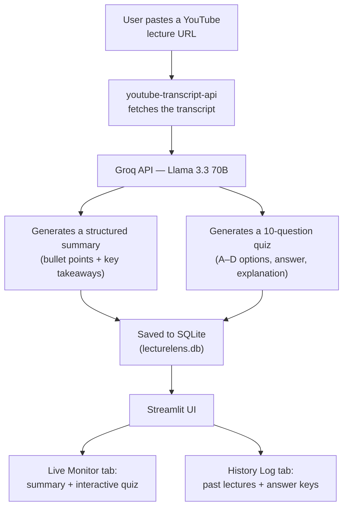

# LectureLens

**An AI-powered lecture summariser and quiz generator** — built as part of the NAVTTC Government-Certified AI Training Program.

Paste any YouTube lecture URL and get back a structured summary with key takeaways, plus an auto-generated 10-question quiz to test what you actually retained — instead of just watching a video and hoping it sticks.

---

## The Problem This Solves

Watching a long lecture doesn't guarantee you remember it. Most students either take rough notes by hand or rewatch the whole video later to find the one part they forgot — both slow, and neither tells you what you actually understood versus what you just heard.

| | Manual note-taking / rewatching | LectureLens |
|---|---|---|
| Getting a summary | Takes notes by hand while watching, or rewatches the video | Structured summary generated automatically in seconds |
| Testing what you retained | No built-in way to check — you just assume you remember it | Auto-generated 10-question quiz, scored instantly |
| Reviewing past lectures | Re-searching old notes or rewatching | Every lecture saved with its summary + quiz, searchable in History Log |
| Works on any lecture | Depends on your own note-taking effort each time | Works on any YouTube video with captions enabled |

---

## Architecture



The transcript is fetched automatically — no manual input needed beyond the URL. Everything the LLM generates is saved to SQLite immediately, so past lectures don't need to be reprocessed; they're just pulled from the database in the History Log tab.

---

## Features

- Paste a YouTube URL, get a structured summary with bullet points and key takeaways
- Auto-generated 10-question multiple-choice quiz (A–D options) with explanations
- Instant scoring (Pass / Average / Fail) with the option to retry anytime
- Every lecture's summary and quiz persisted to SQLite — nothing is lost between sessions
- History Log tab to revisit any past lecture and its answer key
- Works with original, auto-generated, or auto-dubbed YouTube captions

## Tech Stack

| Layer | Technology | Details |
|---|---|---|
| Frontend / UI | **Streamlit** | Custom CSS, Google Fonts, dark theme |
| AI / LLM | **Groq API — Llama 3.3 70B** | Ultra-fast inference, free tier |
| Transcript | **youtube-transcript-api** | Supports original + auto-generated captions |
| Backend | **Python 3.10+** | Core logic in `summariser.py` |
| Database | **SQLite3** | Persistent local storage via `database.py` |
| Deployment | **Docker** + Streamlit Cloud | `Dockerfile` included |
| Environment | **python-dotenv** | `.env`-based API key management |

---

## Getting Started

### 1. Clone the repository

```bash
git clone https://github.com/umberqasim/LectureLens.git
cd LectureLens
```

### 2. Create and activate a virtual environment

```bash
python -m venv venv

# Windows
venv\Scripts\activate

# Mac / Linux
source venv/bin/activate
```

### 3. Install dependencies

```bash
pip install -r requirements.txt
```

### 4. Configure your API key

Create a `.env` file in the project root:

```env
GROQ_API_KEY=your_groq_api_key_here
```

Get a free key at [console.groq.com](https://console.groq.com). The `.env` file is already git-ignored — never commit it.

### 5. Initialise the database

```bash
python database.py
```

This creates `lecturelens.db` locally with the required `history` table.

### 6. Run the app

```bash
streamlit run app.py
```

Open `http://localhost:8501` in your browser.

---

## Project Structure

```
LectureLens/
├── app.py               # Main Streamlit application (UI + logic)
├── summariser.py         # Transcript fetching + Groq summarisation & quiz generation
├── database.py            # SQLite init, save, and retrieval functions
├── requirements.txt         # Pinned dependencies
├── Dockerfile                # Docker deployment configuration
├── .env                        # API key (not committed)
└── .gitignore
```

## Database Schema

```sql
CREATE TABLE history (
    id          INTEGER PRIMARY KEY AUTOINCREMENT,
    url         TEXT NOT NULL,
    summary     TEXT NOT NULL,
    quiz        TEXT NOT NULL,
    created_at  TEXT NOT NULL
);
```

## Known Limitations

- Videos with captions disabled can't be processed — no transcript to work with
- Groq's free tier has rate limits; heavy use may need retry logic
- Very long lectures may exceed the LLM's context window — chunking isn't implemented yet

## Future Improvements

- [ ] Export summary and quiz as PDF
- [ ] Support for multiple languages
- [ ] User authentication with personal history
- [ ] Upload local video/audio files directly
- [ ] Difficulty levels for quiz generation (Easy / Medium / Hard)
- [ ] Track quiz scores over time with performance analytics

## Demo Video

[Watch the full system demo](https://drive.google.com/file/d/1ZdiAzPjFCCnu7rlbg9U3g2hle8gDd5ls/view?usp=sharing) — covers pasting a URL, the generated summary, the interactive quiz, and the History Log.

---

## Author

**Umber Qasim** — Software Engineering Student, Fatima Jinnah Women University, Rawalpindi

Developed as part of the **NAVTTC Government-Certified AI Training Program** (Feb–May 2025).
